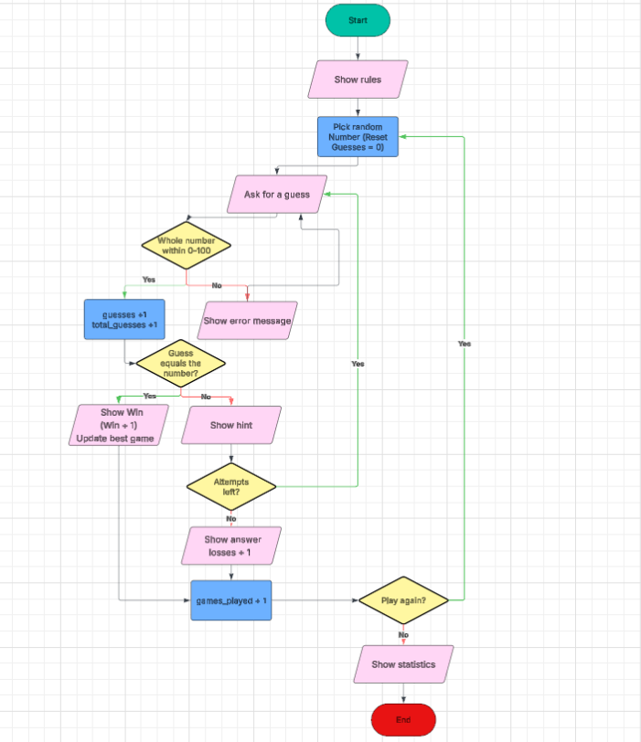

# Guess The Number

A command-line number guessing game written in Python.

## Overview
The computer picks a random number between 0 and 100. You have 6 attempts to guess it. After each wrong guess you are told whether it was too high or too low. Statistics are tracked across rounds.

## Requirements
- Python 3.8 or newer 

## How to Run
1. Download or clone this repository.
2. Open `Python_04_01_Project_PythonGameDevelopment.ipynb` in Jupyter Notebook or JupyterLab.
3. Run the cells in order (**Run → Run All Cells**).
4. Type your guesses into the box that appears under the game cell.

## How to Play
1. Type a whole number between 0 and 100 and press Enter.
2. Use the "Too high" or "Too low" hint to narrow down your next guess.
3. Win by guessing the number within 5 attempts.
4. After each round, choose `y` to play again or `n` to quit.

## Features
- **Input validation:** letters, decimals, empty input and out-of-range numbers are rejected and do not use up an attempt.
- **Hints:** higher/lower feedback after every wrong guess.
- **Statistics:** games played, wins, losses, win rate, average guesses per game and best game.
- **Replay:** a new random number each round.

## Project Structure
| Function | Purpose |
|---|---|
| `rules()` | Prints the instructions |
| `get_valid_guess()` | Asks for and validates input |
| `hint()` | Gives the high/low hint |
| `game_loop()` | Plays one round and updates statistics |
| `show_stats()` | Prints session statistics |
| `play_again()` | Asks whether to play another round |
| `main()` | Runs the whole game |

## Flowchart

